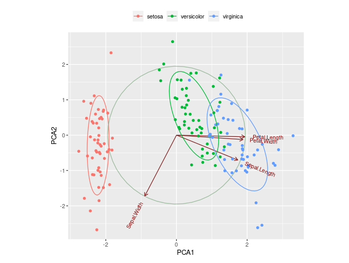
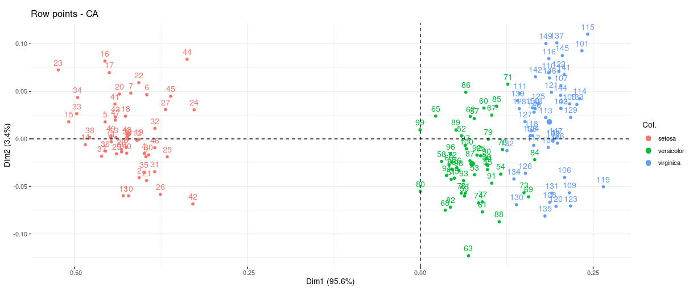

# Data Science Application with R

## Description
Start here! We will introduce this respository in six part.

### Project 1
1. The content of this file is about the basic application of R.
2. You can use this package to output the maximun value of weight and height.
3. Please test the code based on the data provided in the example.
3. CMD: Rscript project1.R --input input1.csv --output output1.csv
   
### Project 2
1. Evalute a mode for predicting loans that are about to default.
2. In this package, you can find the R code to compute the sensitvity, specificity, F1, loglihelihood, pseudoR2, and null model.
3. CMD: Rscript project2.R --target bad/good --badthre <threshold> --input meth1 meth2 ... methx --output result.csv

### Project 3
1. Predict protein subcellular localization.
2. Perform k-fold cross-validation for protein subcellular localization problem.
3. Rscript project3.R --fold k --input Archaeal_tfpssm.csv --output performance.csv

### Project 4
1. Interactive web service of PCA and CA analysis by Shinyapp.
2. Download Dataset on https://www.kaggle.com/datasets/arshid/iris-flower-dataset
3. Web:　https://jacobwu.shinyapps.io/NCCU_DS2023_hw4_111753141/

### Project 5
1. GiveMeSomeCredit(Kaggle:https://www.kaggle.com/c/GiveMeSomeCredit/overview)
2. Our target is about this case that predict the probability that somebody will experience financial distress in the next two years.
3. The AUC score is 0.8646, with only a 0.005 difference from the current first place at that time.
3. CMD:Rscript project5.R --train Data/train.csv --test Data/test.csv --predict result.csv

### Project 6
1. Course kaggle Competition
2. In this case, we predict the accuracy about the good loan or bad loan based on twenty features of costumers.
      
